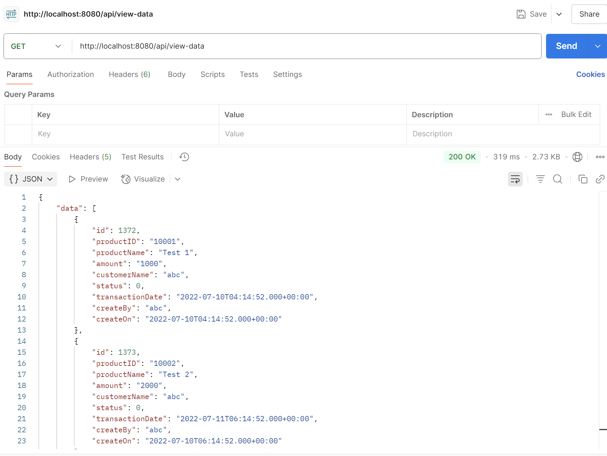

# 🚀 Spring Boot API HASBUL WAFI
NAME : HASBUL WAFI
Project ini adalah contoh aplikasi API menggunakan Java Spring Boot. Aplikasi ini dapat dijalankan secara lokal dan mengakses data dari database MySQL.

## 📥 Cara Clone & Jalankan Proyek Ini

1. Clone Repository

```bash
git clone https://github.com/HasbulWafi6/springboot-api-hasbulwafi.git
Rename Project menjadi springboot-api.

2. Import Database

Import db springboot_api.sql

3. Running

Jalankan di terminal mvn spring-boot:run

Dan berikut hasil endpoint di postman

